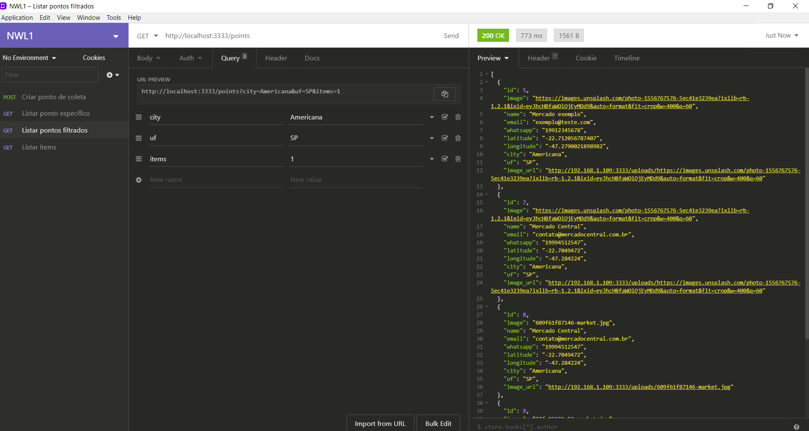
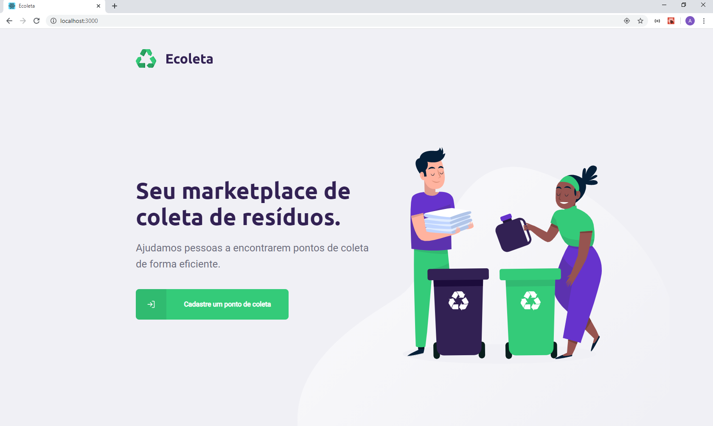
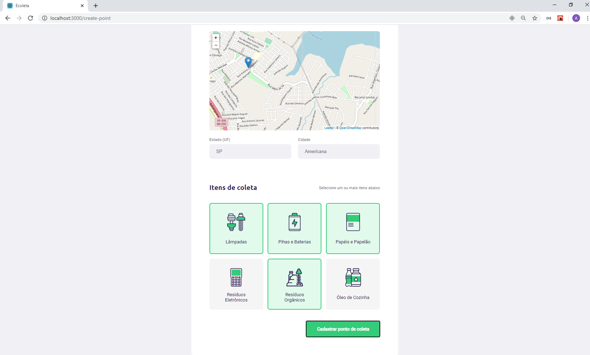
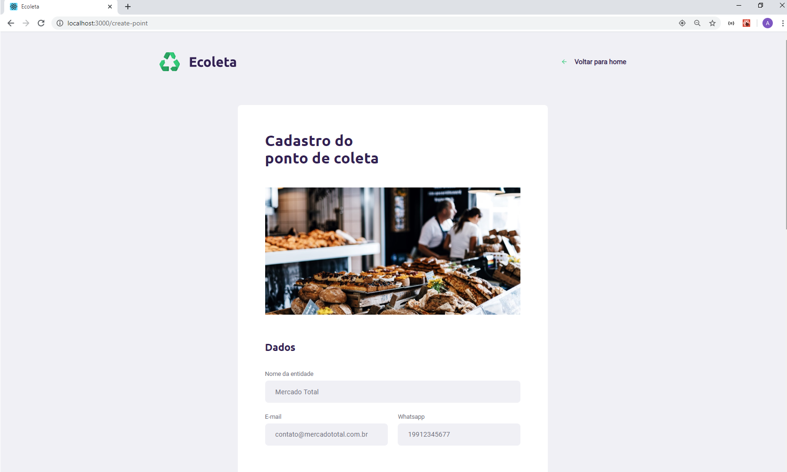
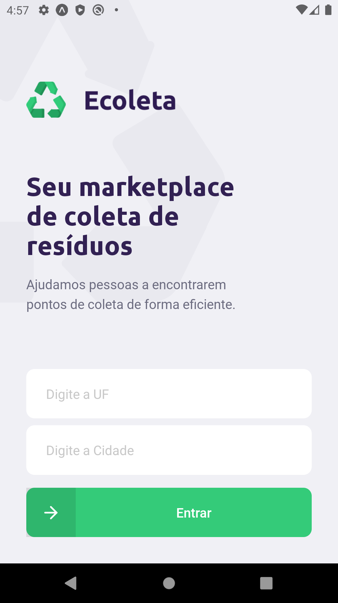
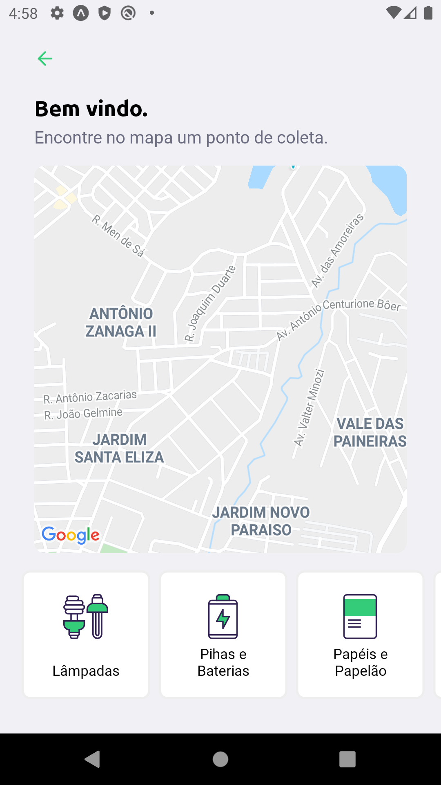
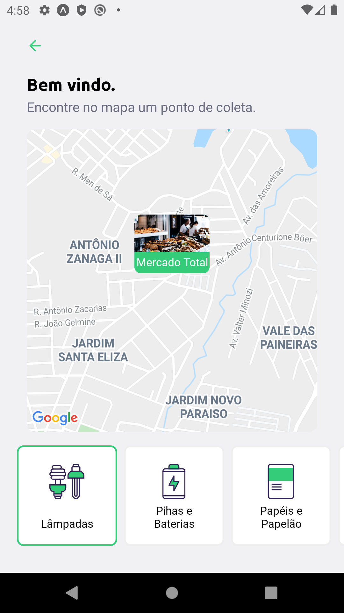
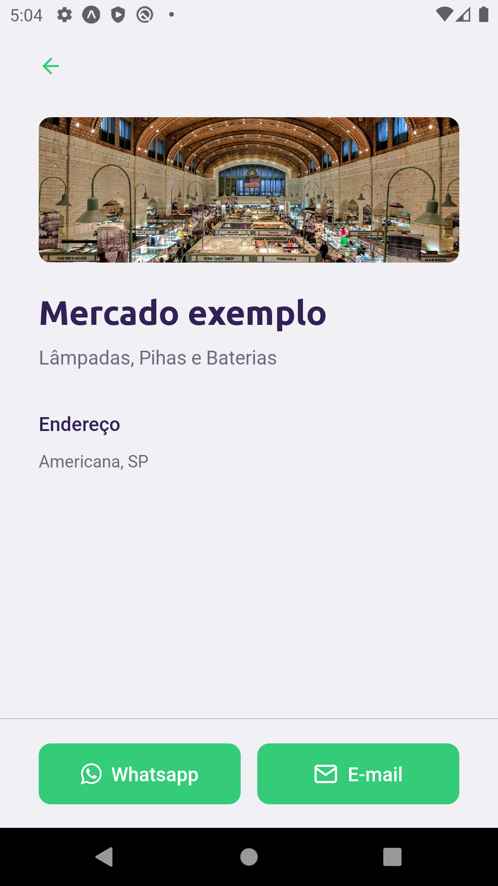

# rocketseat-nlw-01
Projeto contruído durante o Next Level Week #01

# Descritivo
Trata de uma solução que é feito através de uma página Web o cadastro de pontos de coleta de resíduos e seus respectivos items. Também contempla um app Mobile onde se é informado no mapa pontos previamente cadastrados e que estejam próximos do local de acesso do app.

# backend
Desenvolvido em NodeJS
(Para testar) yarn dev

## screenshots

# web
Desenvolvido em ReactJS
(Para testar) yarn start

## screenshots

# mobile
Desenvolvido em React Native
(Para testar) yarn start

## screenshots

### Tecnologias e Bibliotecas utilizadas
• TypeScript
• Knex
• SQLite
• CORS
• React-Icons (Feather Icons)
• React-Router-DOM
• Leaflet
• React-Leaflet
• Axios
• Expo
• Expo-Google-Fonts
• Expo-Constants
• Expo-React-Native-Maps
• Expo-React-Native-Svg
• Expo-Location
• Expo-Mail-Composer
• React-Navigation
• React-Native-Gesture-Handler
• React-Native-Reanimated
• React-Native-Screens
• React-Native-Safe-Area-Context
• React-Native-Picker-Select
• React-Dropzone
• Masked-View
• Multer
• Yup
• Celebrate
